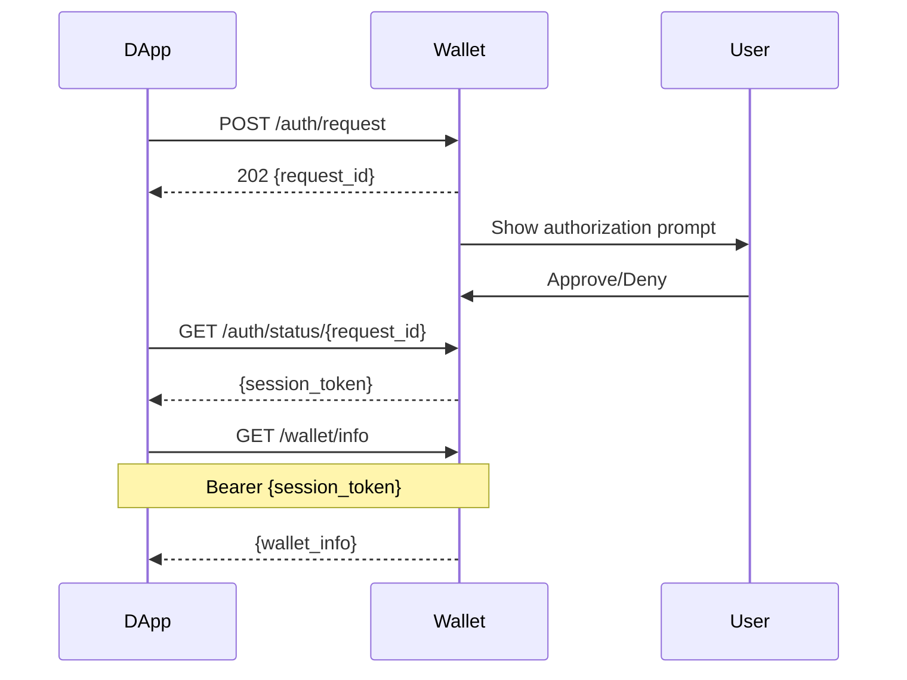

# Xian Universal Wallet Protocol

[](protocol/SPECIFICATION.md)
[](protocol/openapi.yaml)
[](LICENSE)

A language-agnostic protocol specification for wallet and DApp communication on the Xian blockchain.

## 🎯 Overview

The Xian Universal Wallet Protocol (UWP) defines a standard interface that enables any decentralized application (DApp) to communicate with any wallet implementation, regardless of the programming languages used by either party.

### Key Features

- **🌐 Language Agnostic**: Implement in any programming language
- **🔒 Secure by Design**: Permission-based access control with session management
- **📡 Real-time Support**: Optional WebSocket for live updates
- **🧪 Testable**: Comprehensive test vectors for compliance verification
- **📚 Well Documented**: Complete OpenAPI specification and JSON schemas

## 🏗️ Repository Structure

```
xian-uwp/
├── protocol/                 # Protocol Specification (Language Agnostic)
│   ├── openapi.yaml         # OpenAPI 3.0 specification
│   ├── SPECIFICATION.md     # Human-readable specification
│   ├── schemas/             # JSON Schema definitions
│   │   ├── requests/        # Request message schemas
│   │   ├── responses/       # Response message schemas
│   │   └── events/          # WebSocket event schemas
│   └── test-vectors/        # Compliance test vectors
│
├── reference/               # Reference Implementations
│   └── python/             # Python reference implementation
│       ├── xian_uwp/       # Protocol implementation
│       ├── pyproject.toml  # Package configuration
│       └── README.md       # Implementation guide
│
├── docs/                    # Additional Documentation
│   ├── IMPLEMENTATION.md   # Implementation guide
│   └── COMPLIANCE.md       # Compliance testing guide
│
└── README.md               # This file
```

## 🚀 Quick Start

### For DApp Developers

DApps can connect to any wallet implementing the protocol:

```javascript
// JavaScript/TypeScript
const response = await fetch('http://localhost:8545/api/v1/auth/request', {
  method: 'POST',
  headers: { 'Content-Type': 'application/json' },
  body: JSON.stringify({
    app_name: 'My DApp',
    app_url: 'https://mydapp.com',
    permissions: ['wallet_info', 'balance', 'transactions']
  })
});

const { request_id } = await response.json();
// Poll for authorization approval...
```

```python
# Python
from xian_uwp.client import XianWalletClientSync

client = XianWalletClientSync("My DApp", "https://mydapp.com")
if client.connect():
    balance = client.get_balance("currency")
    print(f"Balance: {balance}")
```

### For Wallet Developers

Implement the protocol endpoints in your preferred language:

```python
# Python Reference Implementation
from xian_uwp.server import WalletProtocolServer
from xian_uwp.models import WalletType

server = WalletProtocolServer(wallet_type=WalletType.DESKTOP)
server.configure_network("https://testnet.xian.org", "xian-testnet-1")
server.run(port=8545)
```

For other languages, implement the endpoints defined in [`protocol/openapi.yaml`](protocol/openapi.yaml).

## 📋 Protocol Specification

### Core Endpoints

| Endpoint | Method | Description | Auth Required |
|----------|--------|-------------|---------------|
| `/api/v1/wallet/status` | GET | Check wallet availability | No |
| `/api/v1/auth/request` | POST | Request authorization | No |
| `/api/v1/auth/status/{id}` | GET | Check auth status | No |
| `/api/v1/wallet/info` | GET | Get wallet information | Yes |
| `/api/v1/transaction` | POST | Send transaction | Yes |
| `/api/v1/balance/{contract}` | GET | Get token balance | Yes |
| `/api/v1/sign` | POST | Sign message | Yes |

### Authorization Flow



### Permissions

| Permission | Description |
|------------|-------------|
| `wallet_info` | Access wallet address and type |
| `balance` | Read token balances |
| `transactions` | Send transactions |
| `sign_message` | Sign messages |
| `add_token` | Add custom tokens |

## 🧪 Compliance Testing

Implementations must pass the protocol test vectors:

```bash
# Using the Python validator
python protocol/validator.py --url http://localhost:8545

# Manual testing with test vectors
curl -X POST http://localhost:8545/api/v1/auth/request \
  -H "Content-Type: application/json" \
  -d @protocol/test-vectors/auth-flow.json
```

## 🛠️ Implementation Guide

### Step 1: Review the Specification

Read the [Protocol Specification](protocol/SPECIFICATION.md) to understand requirements.

### Step 2: Use the OpenAPI Spec

Generate server stubs or client SDKs from [`protocol/openapi.yaml`](protocol/openapi.yaml):

```bash
# Generate server stub (example with openapi-generator)
openapi-generator generate -i protocol/openapi.yaml \
  -g python-fastapi -o my-wallet-server

# Generate client SDK
openapi-generator generate -i protocol/openapi.yaml \
  -g typescript-axios -o my-dapp-client
```

### Step 3: Implement Required Endpoints

At minimum, implement:
1. `GET /api/v1/wallet/status`
2. `POST /api/v1/auth/request`
3. `GET /api/v1/auth/status/{request_id}`
4. `GET /api/v1/wallet/info` (authenticated)
5. `POST /api/v1/transaction` (authenticated)

### Step 4: Validate Compliance

Run test vectors against your implementation to ensure compatibility.

## 📦 Available Implementations

### Official Reference

- **Python**: [`reference/python`](reference/python) - Full-featured reference implementation

### Community Implementations

*Coming soon:*
- JavaScript/TypeScript
- Rust
- Go
- C#/.NET

Want to contribute an implementation? See [CONTRIBUTING.md](CONTRIBUTING.md).

## 🔒 Security Considerations

- **Use HTTPS in production** (HTTP only for local development)
- **Implement rate limiting** for auth attempts and transactions
- **Validate all inputs** according to JSON schemas
- **Use secure session tokens** (minimum 256 bits entropy)
- **Implement proper CORS** for web-based DApps

## 📚 Resources

- [Protocol Specification](protocol/SPECIFICATION.md) - Detailed protocol documentation
- [OpenAPI Specification](protocol/openapi.yaml) - Machine-readable API definition
- [JSON Schemas](protocol/schemas/) - Message format definitions
- [Test Vectors](protocol/test-vectors/) - Compliance test cases
- [Python Reference](reference/python/) - Reference implementation

## 🤝 Contributing

We welcome contributions! Please see [CONTRIBUTING.md](CONTRIBUTING.md) for guidelines.

### Areas for Contribution

- Additional language implementations
- Protocol improvements (submit RFC)
- Test vector additions
- Documentation improvements
- Security audits

## 📄 License

MIT License - see [LICENSE](LICENSE) file for details.

## 🔗 Links

- [Xian Network](https://xian.org)
- [GitHub Repository](https://github.com/xian-network/xian-uwp)
- [Discord Community](https://discord.gg/xian)
- [Protocol Discussion](https://github.com/xian-network/xian-uwp/discussions)

---

**Protocol Version**: 2.0.0  
**Status**: Production Ready  
**Last Updated**: 2024

**Examples:**
- React DApp on Vercel → CORS-enabled HTTP → Local Python wallet
- Python Flask app → Direct HTTP → Server-hosted Python wallet  
- Mobile app → HTTP API → User's local Python wallet
- Electron desktop app → HTTP → Local Python wallet daemon

### 🎯 **Protocol Benefits**

- **Universal Interface**: All wallets expose identical HTTP API on port 8545
- **Language Independent**: DApps can use any programming language that supports HTTP
- **Deployment Flexible**: Both wallets and DApps can run locally or on servers
- **Technology Agnostic**: Works with any web framework, mobile framework, or desktop technology
- **CORS-Enabled**: Server-hosted DApps can connect to local wallets securely
- **Professional Features**: Session-based auth, permission system, caching, error handling

## How the Protocol Works

### 1. Standard Port & API
All Xian wallets run a local HTTP server on `localhost:8545` with standardized endpoints:

```
GET  /api/v1/wallet/status        # Check wallet availability
POST /api/v1/auth/request         # Request DApp authorization  
GET  /api/v1/wallet/info          # Get wallet information
GET  /api/v1/balance/{contract}   # Get token balance
POST /api/v1/transaction          # Send transaction
POST /api/v1/sign                 # Sign message
```

### 2. Authorization Flow
1. DApp requests authorization with permissions
2. Wallet shows approval UI to user
3. User approves/denies the request
4. Wallet returns session token to DApp
5. DApp uses token for subsequent requests

### 3. Session Management
- Time-limited session tokens (default 1 hour)
- Permission-based access control
- Auto-lock after inactivity
- Multiple concurrent sessions supported

## Wallet Implementation Guide

### Desktop Wallet Implementation

Desktop wallets run the protocol server directly in the application:

```python
from xian_uwp.server import WalletProtocolServer
from xian_uwp.models import WalletType

# Create server instance
server = WalletProtocolServer(wallet_type=WalletType.DESKTOP)

# Load your wallet
server.wallet = your_wallet_instance
server.password_hash = your_password_hash
server.is_locked = False

# Run server (same config for all wallet types)
server.run()  # Uses defaults: host="127.0.0.1", port=8545

# Or with custom port if 8545 is in use
server.run(port=8546)
```

**Key Implementation Points:**
- Embed server in your desktop app
- Handle user authorization via native UI
- Manage wallet unlock/lock states
- Optional: Add systray integration

### CLI Wallet Implementation  

CLI wallets run as daemon processes:

```bash
# Create wallet
xian-wallet create

# Start daemon
xian-wallet start --background

# Check status  
xian-wallet status
```

```python
# CLI daemon implementation
class CLIWalletDaemon:
    def start_daemon(self, password):
        # Load wallet from encrypted file
        wallet = self.load_wallet(password)
        
        # Create and start server (same config for all wallet types)
        server = WalletProtocolServer(wallet_type=WalletType.CLI)
        server.wallet = wallet
        server.run()  # Uses defaults: host="127.0.0.1", port=8545
```

**Key Implementation Points:**
- Encrypted wallet storage on disk
- Background daemon process
- Command-line interface for management
- Auto-approval or terminal-based approval UI

### Web Wallet (Flet-based) Implementation

Web wallets run in the browser but use Python/Flet:

```python
from xian_uwp.server import WalletProtocolServer
from xian_uwp.models import WalletType
import flet as ft

# Create server instance  
server = WalletProtocolServer(wallet_type=WalletType.WEB)

# Load your wallet
server.wallet = your_wallet_instance
server.password_hash = your_password_hash
server.is_locked = False

# Run server in background thread (same config for all wallet types)
def run_server():
    server.run()  # Uses defaults: host="127.0.0.1", port=8545

# Run Flet web interface on different port
ft.app(target=main, view=ft.AppView.WEB_BROWSER, port=8080)
```

**Key Implementation Points:**
- Flet-based web interface (100% Python)
- Same codebase as desktop wallet
- Works on any device with browser
- No browser extension needed
- Professional UI with tabs and responsive design

## DApp Integration

### Using the Universal Client

DApps use the same client library regardless of wallet type:

```python
from xian_uwp.client import XianWalletClientSync

# Create client - works with any wallet type
client = XianWalletClientSync(
    app_name="My DApp", 
    app_url="http://localhost:8080",
    server_url="http://localhost:8545"  # Optional: custom port
)

# Connect to any wallet
if client.connect():
    # Use identical API regardless of wallet type
    wallet_info = client.get_wallet_info()
    balance = client.get_balance("currency")
    result = client.send_transaction("currency", "transfer", {"to": "addr", "amount": 100})
else:
    print("Failed to connect to wallet")
```

### JavaScript Example

For JavaScript DApps, use the HTTP API directly:

```javascript
// Connect to wallet via HTTP API
const response = await fetch('http://localhost:8545/api/v1/wallet/status');
const status = await response.json();
console.log('Wallet available:', status.available);
```

## API Reference

### Core Endpoints

#### GET /api/v1/wallet/status
Check if wallet is available and its current state. No authentication required.

**Response:**
```json
{
  "available": true,
  "locked": false,
  "wallet_type": "desktop",
  "network": "https://testnet.xian.org",
  "chain_id": "xian-testnet",
  "version": "1.0.0"
}
```

#### POST /api/v1/auth/request
Request authorization from the wallet. The wallet will prompt the user to approve/deny.

**Request Body:**
```json
{
  "app_name": "My DApp",
  "app_url": "http://localhost:8080", 
  "permissions": ["wallet_info", "balance", "transactions"],
  "description": "Optional description of why permissions are needed"
}
```

**Available Permissions:**
- `wallet_info` - Read wallet address and basic info
- `balance` - Read token balances
- `transactions` - Send transactions
- `sign_message` - Sign messages
- `add_token` - Add custom tokens to wallet

**Response:**
```json
{
  "request_id": "req_abc123",
  "status": "pending"
}
```

#### POST /api/v1/auth/approve/{request_id}
Approve an authorization request. Usually called by the wallet UI after user approval.

**Response:**
```json
{
  "session_token": "token_xyz789",
  "expires_at": "2024-01-01T12:00:00Z",
  "permissions": ["wallet_info", "balance", "transactions"]
}
```

#### POST /api/v1/auth/deny/{request_id}
Deny an authorization request. Usually called by the wallet UI after user denial.

**Response:**
```json
{
  "status": "denied",
  "reason": "User denied authorization"
}
```

#### GET /api/v1/wallet/info
*Requires Authorization: Bearer {session_token}*

Get wallet information. Requires `wallet_info` permission.

**Response:**
```json
{
  "address": "abc123...",
  "truncated_address": "abc123...xyz789",
  "locked": false,
  "chain_id": "xian-testnet", 
  "network": "https://testnet.xian.org",
  "wallet_type": "desktop",
  "version": "1.0.0"
}
```

#### POST /api/v1/wallet/unlock
Unlock the wallet with password. No authentication required.

**Request Body:**
```json
{
  "password": "wallet_password"
}
```

**Response:**
```json
{
  "unlocked": true,
  "message": "Wallet unlocked successfully"
}
```

#### POST /api/v1/wallet/lock
Lock the wallet. Requires valid session.

**Response:**
```json
{
  "locked": true,
  "message": "Wallet locked successfully"
}
```

#### GET /api/v1/balance/{contract}
*Requires Authorization: Bearer {session_token}*

```json
{
  "balance": 1000.0,
  "contract": "currency",
  "symbol": "XIAN",
  "decimals": 8
}
```

#### POST /api/v1/transaction
*Requires Authorization: Bearer {session_token}*

Send a transaction to the blockchain. Requires `transactions` permission.

**Request Body:**
```json
{
  "contract": "currency",
  "function": "transfer",
  "kwargs": {"to": "recipient_address", "amount": 100},
  "stamps_supplied": 50000
}
```

**Response (Success):**
```json
{
  "success": true,
  "transaction_hash": "tx_hash_here",
  "result": "transaction_result",
  "gas_used": 45000
}
```

**Response (Failure):**
```json
{
  "success": false,
  "errors": ["Insufficient balance"],
  "transaction_hash": null
}
```

#### POST /api/v1/sign
*Requires Authorization: Bearer {session_token}*

Sign a message with the wallet's private key. Requires `sign_message` permission.

**Request Body:**
```json
{
  "message": "Message to sign"
}
```

**Response:**
```json
{
  "message": "Message to sign",
  "signature": "signature_hex",
  "signer": "wallet_address"
}
```

#### POST /api/v1/tokens/add
*Requires Authorization: Bearer {session_token}*

Add a custom token to the wallet. Requires `add_token` permission.

**Request Body:**
```json
{
  "contract_address": "token_contract",
  "token_name": "My Token",
  "token_symbol": "MTK"
}
```

**Response:**
```json
{
  "accepted": true,
  "contract": "token_contract"
}
```

### WebSocket API

#### WS /ws/v1
WebSocket endpoint for real-time communication. Useful for wallet UIs and monitoring.

**Connection:**
```javascript
const ws = new WebSocket('ws://localhost:8545/ws/v1');
```

**Message Types:**

**Ping/Pong:**
```json
// Send
{"type": "ping"}

// Receive
{"type": "pong", "timestamp": "2024-01-01T12:00:00Z"}
```

**Authorization Request Event:**
```json
{
  "type": "authorization_request",
  "request": {
    "request_id": "req_abc123",
    "app_name": "My DApp",
    "permissions": ["wallet_info", "balance"],
    "created_at": "2024-01-01T12:00:00Z"
  }
}
```

**Transaction Event:**
```json
{
  "type": "transaction",
  "data": {
    "hash": "tx_hash",
    "status": "pending|success|failed",
    "contract": "currency",
    "function": "transfer"
  }
}
```

## Installation & Setup

### 1. Install Core Protocol

```bash
# Clone the repository
git clone https://github.com/Endogen/xian-uwp.git
cd xian-uwp

# For Python implementations, install dependencies
cd reference/python
pip install -r requirements.txt  # If available
```

**Core Protocol Dependencies (Python Reference):**
- `fastapi` - HTTP API server framework
- `uvicorn` - ASGI server to run FastAPI
- `httpx` - Async HTTP client for wallet connections  
- `websockets` - WebSocket support for real-time communication
- `pydantic` - Data validation and serialization
- `xian-py` - Xian blockchain SDK for wallet operations

> **Note**: The protocol specification is language-agnostic. You can implement it in any programming language.

### 2. Using the Protocol

**For Python Implementations:**

**For DApp Development:**
```python
from xian_uwp.client import XianWalletClientSync

# Connect to any wallet
client = XianWalletClientSync("My DApp")
client.connect()

# Use wallet functionality
info = client.get_wallet_info()
balance = client.get_balance("currency")
```

**For Wallet Development:**
```python
from xian_uwp.server import WalletProtocolServer
from xian_uwp.models import WalletType

# Create protocol server
server = WalletProtocolServer(wallet_type=WalletType.DESKTOP)
server.wallet = your_wallet_instance
server.run()  # Starts on localhost:8545
```

### 3. Project Structure

```
xian-uwp/
├── protocol/              # Language-agnostic protocol specification
│   ├── SPECIFICATION.md   # Complete protocol specification
│   ├── openapi.yaml       # OpenAPI 3.0 specification
│   ├── schemas/           # JSON Schema definitions
│   │   ├── events/        # WebSocket event schemas
│   │   ├── requests/      # Request message schemas
│   │   └── responses/     # Response message schemas
│   ├── test-vectors/      # Compliance test vectors
│   │   ├── auth-flow.json
│   │   └── transaction-flow.json
│   └── validator.py       # Test vector validator
├── reference/             # Reference implementations
│   └── python/            # Python reference implementation
│       ├── xian_uwp/
│       │   ├── __init__.py
│       │   ├── models.py      # Data models & constants
│       │   ├── server.py      # Protocol server implementation
│       │   ├── server_utils.py # Server utilities
│       │   └── client.py      # Client library
│       └── README.md
├── docs/                  # Documentation
│   ├── IMPLEMENTATION.md  # Implementation guide
│   └── COMPLIANCE.md      # Compliance testing guide
├── CONTRIBUTING.md        # Contribution guidelines
└── README.md
```

**Important Notes:**
- **Protocol Specification**: The `protocol/` directory contains the language-agnostic specification
- **Reference Implementation**: The `reference/python/` directory contains a Python implementation
- **Test Vectors**: Use the test vectors in `protocol/test-vectors/` to verify compliance
- **Language Support**: Implementations can be created in any programming language

### 4. Testing the Protocol

**Run Test Vectors:**
```bash
# Validate your implementation against test vectors
cd protocol
python validator.py

# This will validate the test vectors in:
# - test-vectors/auth-flow.json
# - test-vectors/transaction-flow.json
```

**Start a Test Server:**
```bash
# Using the Python reference implementation
cd reference/python
python -m xian_uwp.server

# Server starts on localhost:8545
# Creates a demo wallet for testing
```

### 5. Implementation Guide

See the [Implementation Guide](docs/IMPLEMENTATION.md) for:
- Step-by-step implementation instructions
- Security requirements
- Error handling guidelines
- Best practices

### 6. Compliance Testing

See the [Compliance Guide](docs/COMPLIANCE.md) for:
- Test vector structure
- Validation requirements
- Compliance certification process

### 7. Protocol Specification

The complete protocol specification is available in:
- [Protocol Specification](protocol/SPECIFICATION.md) - Human-readable specification
- [OpenAPI Specification](protocol/openapi.yaml) - Machine-readable API definition
- [JSON Schemas](protocol/schemas/) - Message format definitions

## Implementation Examples

### Python DApp Implementation

```python
# Using the Python reference implementation
from xian_uwp.client import XianWalletClientSync

class MyDApp:
    def __init__(self):
        self.client = XianWalletClientSync("My DApp")
    
    def connect_wallet(self):
        if self.client.connect():
            info = self.client.get_wallet_info()
            print(f"Connected: {info.address}")
            return True
        return False
    
    def send_tokens(self, to, amount):
        result = self.client.send_transaction(
            "currency", "transfer", 
            {"to": to, "amount": amount}
        )
        return result.success
```

### Python Wallet Implementation

```python
# Using the Python reference implementation
from xian_uwp.server import WalletProtocolServer
from xian_uwp.models import WalletType

# Create and configure server
server = WalletProtocolServer(
    wallet_type=WalletType.DESKTOP,
    session_duration=3600,
    auto_lock_minutes=30
)

# Set up wallet handlers
@server.on_authorize
def handle_authorization(app_name, permissions):
    # Show authorization UI to user
    # Return True if approved, False if denied
    return user_approves(app_name, permissions)

@server.on_sign_transaction
def handle_transaction(tx_data):
    # Show transaction details to user
    # Sign if approved
    if user_approves_tx(tx_data):
        return sign_transaction(tx_data)
    return None

# Start server
server.run()  # Starts on localhost:8545
```

### JavaScript DApp Implementation

```javascript
// Direct HTTP API implementation
class XianWalletClient {
    constructor(appName, appUrl = 'http://localhost', serverUrl = 'http://127.0.0.1:8545') {
        this.appName = appName;
        this.appUrl = appUrl;
        this.serverUrl = serverUrl;
        this.sessionToken = null;
        this.isConnected = false;
    }

    async connect() {
        // Request authorization
        const authResponse = await fetch(`${this.serverUrl}/api/v1/authorize`, {
            method: 'POST',
            headers: { 'Content-Type': 'application/json' },
            body: JSON.stringify({
                app_name: this.appName,
                app_url: this.appUrl,
                permissions: ['view_balance', 'send_transaction']
            })
        });
        
        const auth = await authResponse.json();
        
        // Poll for approval
        while (true) {
            const statusResponse = await fetch(
                `${this.serverUrl}/api/v1/authorize/${auth.request_id}`
            );
            const status = await statusResponse.json();
            
            if (status.status === 'approved') {
                this.sessionToken = status.session_token;
                this.isConnected = true;
                return true;
            } else if (status.status === 'denied') {
                return false;
            }
            
            await new Promise(resolve => setTimeout(resolve, 1000));
        }
    }

    async sendTransaction(contract, functionName, kwargs, stampsSupplied = 50000) {
        const response = await fetch(`${this.serverUrl}/api/v1/transaction`, {
            method: 'POST',
            headers: {
                'Content-Type': 'application/json',
                'Authorization': `Bearer ${this.sessionToken}`
            },
            body: JSON.stringify({
                contract, 
                function: functionName, 
                kwargs, 
                stamps_supplied: stampsSupplied
            })
        });
        return await response.json();
    }
}
```

### Web DApp Example

```html
<!-- Direct HTTP API usage -->
<script>
// Works with any wallet type (desktop, web, CLI)
fetch('http://localhost:8545/api/v1/wallet/status')
    .then(response => response.json())
    .then(status => {
        if (status.available) {
            console.log('Wallet available');
        }
    });
</script>
```

**Note:** All wallet types provide the same localhost:8545 API, so existing JavaScript code works unchanged.

## Configuration Options

### Server Configuration

```python
from xian_uwp.server import WalletProtocolServer
from xian_uwp.models import WalletType

# Create server with options
server = WalletProtocolServer(
    wallet_type=WalletType.DESKTOP,
    session_duration=7200,  # 2 hours (default: 3600)
    auto_lock_minutes=15,   # Auto-lock after 15 min (default: 30)
    max_sessions=10         # Max concurrent sessions (default: 100)
)

# Network configuration (required for transaction functionality)
# Option 1: Set during server creation
server = WalletProtocolServer(
    wallet_type=WalletType.DESKTOP,
    network_url="https://mainnet.xian.org",
    chain_id="xian-mainnet"
)

# Option 2: Configure after creation
server.configure_network("https://mainnet.xian.org", "xian-mainnet")

# Run on custom port
server.run(host="127.0.0.1", port=8546)
```

### Client Configuration

```python
from xian_uwp.client import XianWalletClientSync

# Create client with options
client = XianWalletClientSync(
    app_name="My DApp",
    app_url="http://localhost:3000",
    server_url="http://localhost:8546",  # Custom wallet URL/port
    permissions=["wallet_info", "balance", "transactions"]  # Request specific permissions
)

# Async client with custom settings
from xian_uwp.client import XianWalletClient

async_client = XianWalletClient(
    app_name="My Async DApp",
    app_url="http://localhost:3000",
    server_url="http://localhost:8545",
    permissions=["wallet_info", "balance"]
)
```

### CORS Configuration

For web-based DApps hosted on servers, the protocol includes comprehensive CORS support:

```python
from xian_uwp import create_server, CORSConfig

# Development mode (default) - allows common dev ports
server = create_server(cors_config=CORSConfig.localhost_dev())
server.run()

# Production mode - specific origins only
cors_config = CORSConfig.production([
    "https://mydapp.com",
    "https://app.mydapp.com"
])
server = create_server(cors_config=cors_config)
server.run(host="0.0.0.0", port=8545)  # Allow external connections

# Custom CORS configuration
cors_config = CORSConfig(
    allow_origins=["http://localhost:3000", "https://mydapp.com"],
    allow_credentials=True,
    allow_methods=["GET", "POST", "OPTIONS"],
    allow_headers=["Authorization", "Content-Type"],
    max_age=3600
)
server = create_server(cors_config=cors_config)
```

#### CORS Presets

- **`CORSConfig.development()`**: Allows all origins (for development)
- **`CORSConfig.localhost_dev()`**: Common dev ports (3000, 5173, 8080, etc.)
- **`CORSConfig.production(origins)`**: Specific origins only (for production)

#### Web DApp Integration

```javascript
// JavaScript client connecting to local wallet
const client = new XianWalletClient(
    'My Web DApp',
    window.location.origin,  // Current web app origin
    'http://localhost:8545'  // Local wallet server
);

await client.connect();
const balance = await client.getBalance('currency');
```

## Security Considerations

### Local-Only Communication
- Server binds to 127.0.0.1 only (no external access)
- No cross-origin issues (same machine)
- No network exposure of wallet operations

### Session Security
- Time-limited tokens with automatic expiration
- Permission-based access control
- Session invalidation on wallet lock
- Multiple session support with individual revocation

### Data Protection
- No sensitive data in logs
- Encrypted wallet storage (CLI)
- Secure password handling (SHA256 minimum)
- Auto-lock on inactivity

## Production Deployment

### For Wallet Developers

1. **Implement the protocol server** in your wallet
2. **Handle authorization UI** for user approval
3. **Manage session lifecycle** properly
4. **Add proper error handling** and logging
5. **Test with multiple DApps** to ensure compatibility

### For DApp Developers

1. **Use the universal client library** for any language
2. **Handle connection errors** gracefully
3. **Implement user-friendly authorization** requests
4. **Cache wallet info** appropriately
5. **Test with multiple wallet types**

## Why Use Xian UWP?

### Benefits

- **Multi-wallet support**: Works with any wallet implementation
- **Language agnostic**: Use Python, JavaScript, or any language
- **Better performance**: Direct HTTP communication
- **More reliable**: Standardized protocol with clear specifications
- **Future-proof**: Extensible design for new features

## Development & Testing

### Running the Protocol Server Directly

```bash
# Start a demo server for testing
python -m protocol.server

# The server will:
# - Start on localhost:8545
# - Create a demo wallet automatically
# - Log the wallet address for testing
# - Accept connections from DApps
```

### Testing with the Client

```python
from xian_uwp.client import XianWalletClientSync

# Create client
client = XianWalletClientSync("Test App")

# Connect and request authorization
if client.connect():
    print("Connected!")
    
    # The wallet UI will show authorization request
    # After approval, you can use the wallet
    info = client.get_wallet_info()
    print(f"Wallet: {info.truncated_address}")
```

### Testing Authorization Flow

```python
import asyncio
from xian_uwp.client import XianWalletClient

async def test_auth_flow():
    client = XianWalletClient("Test DApp")
    
    # Request authorization
    request_id = await client._request_authorization(["wallet_info", "balance"])
    print(f"Authorization requested: {request_id}")
    
    # In a real wallet, user would approve via UI
    # For testing, you can manually approve:
    # POST http://localhost:8545/api/v1/auth/approve/{request_id}
    
    # Wait for approval
    session = await client._wait_for_approval(request_id)
    if session:
        print(f"Approved! Token: {session.session_token}")

asyncio.run(test_auth_flow())
```

### Test Different Wallet Types

```bash
# Test desktop wallet example
PYTHONPATH=. python examples/wallets/desktop.py

# Test web wallet example
PYTHONPATH=. python examples/wallets/web.py

# Test CLI wallet example
PYTHONPATH=. python examples/wallets/cli.py start
```

### Run Examples

```bash
# Install example dependencies first
pip install flet>=0.28.3      # For Flet examples
pip install reflex>=0.8.6     # For Reflex examples

# Run Flet DApp example
PYTHONPATH=. python examples/dapps/universal_dapp.py

# Run Reflex DApp example
cd examples/dapps && PYTHONPATH=../.. reflex run

# Run HTML/JS DApp example (no dependencies)
cd examples/dapps/html-js-dapp && python -m http.server 8080
# Then open http://localhost:8080 in your browser
```

## Error Handling

### HTTP Status Codes

- `200` - Success
- `400` - Bad Request (invalid parameters)
- `401` - Unauthorized (missing or invalid token)
- `403` - Forbidden (insufficient permissions)
- `404` - Not Found (invalid endpoint or resource)
- `423` - Locked (wallet is locked)
- `500` - Internal Server Error

### Error Response Format

```json
{
  "detail": "Human-readable error message"
}
```

### Common Error Scenarios

**Wallet Locked:**
```json
{
  "detail": "Wallet is locked"
}
```
*Solution: Unlock wallet via `/api/v1/wallet/unlock`*

**Invalid Session:**
```json
{
  "detail": "Invalid or expired session"
}
```
*Solution: Request new authorization*

**Insufficient Permissions:**
```json
{
  "detail": "Insufficient permissions"
}
```
*Solution: Request authorization with required permissions*

## Troubleshooting

### Common Issues

**Connection Refused**
- Ensure wallet server is running on port 8545
- Check if another service is using port 8545
- Try a different port: `server.run(port=8546)`
- Check firewall settings

**Authorization Failed**
- Verify wallet is unlocked
- Check authorization request was approved
- Ensure permissions match what DApp requests

**Session Expired**
- Tokens expire after 1 hour by default
- Client will auto-reconnect
- Can configure longer expiry in server

### Debug Mode

```bash
# Enable debug logging
export XIAN_WALLET_DEBUG=1
PYTHONPATH=. python examples/wallets/desktop.py

# Or in code
import logging
logging.basicConfig(level=logging.DEBUG)
```

## Best Practices

### For Wallet Developers

1. **Authorization UI**
   - Show clear permission requests
   - Display app name and URL prominently
   - Allow users to approve/deny individual permissions
   - Show session duration

2. **Security**
   - Always validate session tokens
   - Consider implementing rate limiting
   - Log authorization attempts
   - Auto-lock on inactivity (configurable)
   - Clear sessions on wallet lock

3. **User Experience**
   - Show pending authorization requests
   - Notify users of transaction requests
   - Display clear error messages
   - Implement transaction confirmation UI

### For DApp Developers

1. **Connection Handling**
   ```python
   # Always check connection status
   if not client.is_connected():
       client.connect()
   
   # Handle connection failures gracefully
   try:
       balance = client.get_balance("currency")
   except ConnectionError:
       # Show user-friendly error
       pass
   ```

2. **Permission Management**
   - Only request necessary permissions
   - Explain why permissions are needed
   - Handle permission denials gracefully
   - Cache wallet info appropriately

3. **Error Handling**
   - Catch and handle all exceptions
   - Show meaningful error messages
   - Implement retry logic for transient failures
   - Log errors for debugging

## Future Enhancements

- **Hardware wallet support** via protocol adapters
- **Multi-network support** (mainnet, testnet, custom)
- **Enhanced security** with HSM integration
- **Browser extension version** of web wallet (optional)
- **Mobile wallet support** via Flet mobile apps
- **Cross-platform notifications** for transaction requests
- **QR code authorization** for mobile/remote wallets
- **Multi-signature support** for shared wallets

---

**The Universal Wallet Protocol makes Xian wallet integration simple, secure, and unified across all platforms.**