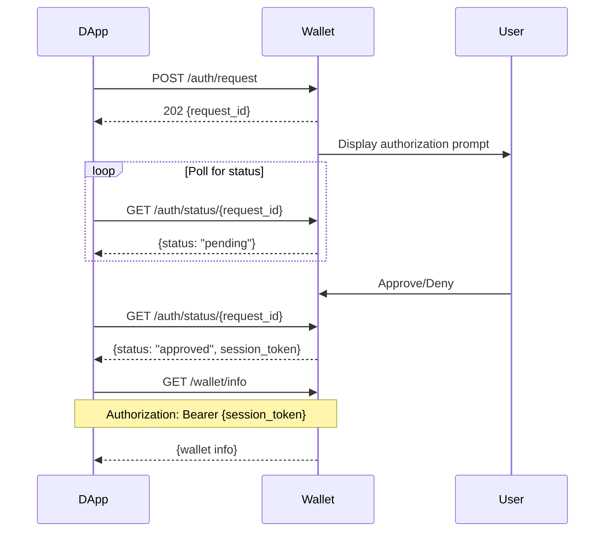

# Xian Universal Wallet Protocol Specification

**Version:** 2.0.0  
**Status:** Draft  
**Last Updated:** 2024

## 1. Introduction

The Xian Universal Wallet Protocol (UWP) is a language-agnostic specification that defines how decentralized applications (DApps) communicate with wallet implementations on the Xian blockchain. This specification ensures interoperability between any wallet implementation and any DApp, regardless of the programming languages used.

### 1.1 Design Principles

- **Language Agnostic**: The protocol can be implemented in any programming language
- **Transport Independent**: While HTTP/JSON is the primary transport, the protocol concepts can be adapted to other transports
- **Security First**: All operations require explicit user authorization
- **Simplicity**: The protocol is simple enough to implement but complete enough for real-world use
- **Extensibility**: New features can be added without breaking existing implementations

### 1.2 Conformance

The key words "MUST", "MUST NOT", "REQUIRED", "SHALL", "SHALL NOT", "SHOULD", "SHOULD NOT", "RECOMMENDED", "MAY", and "OPTIONAL" in this document are to be interpreted as described in [RFC 2119](https://www.ietf.org/rfc/rfc2119.txt).

## 2. Architecture Overview

```
┌─────────────┐         HTTP/WS          ┌─────────────┐
│    DApp     │ ◄──────────────────────► │   Wallet    │
│   (Client)  │                           │  (Server)   │
└─────────────┘                           └─────────────┘
     Any                                       Any
   Language                                 Language
```

### 2.1 Components

- **Wallet Server**: Exposes the protocol API, manages keys, signs transactions
- **DApp Client**: Requests authorization, sends transactions, queries balances
- **Protocol**: Defines the communication format and rules

## 3. Transport Layer

### 3.1 HTTP Transport

- **Protocol**: HTTP/1.1 or HTTP/2
- **Default Port**: 8545 (SHOULD be configurable)
- **Base Path**: `/api/v1`
- **Content Type**: `application/json`
- **Character Encoding**: UTF-8

### 3.2 WebSocket Transport (Optional)

- **Protocol**: WebSocket (RFC 6455)
- **Path**: `/ws/v1`
- **Message Format**: JSON text frames
- **Purpose**: Real-time event notifications

### 3.3 CORS Requirements

Wallet implementations MUST support CORS for web-based DApps:

```
Access-Control-Allow-Origin: *
Access-Control-Allow-Methods: GET, POST, OPTIONS
Access-Control-Allow-Headers: Content-Type, Authorization
Access-Control-Max-Age: 86400
```

Production implementations SHOULD restrict `Access-Control-Allow-Origin` to specific domains.

## 4. Authentication & Authorization

### 4.1 Authorization Flow



### 4.2 Session Management

- Session tokens MUST be cryptographically secure (minimum 256 bits of entropy)
- Sessions MUST expire after a configurable timeout (default: 60 minutes)
- Sessions MUST be revocable by the user
- Implementations SHOULD limit the number of concurrent sessions

### 4.3 Permissions

Permissions control what operations a DApp can perform:

| Permission | Description | Operations Allowed |
|------------|-------------|-------------------|
| `wallet_info` | Basic wallet information | GET /wallet/info |
| `balance` | Read token balances | GET /balance/* |
| `transactions` | Send transactions | POST /transaction |
| `sign_message` | Sign messages | POST /sign |
| `add_token` | Add custom tokens | POST /tokens/add |

## 5. API Endpoints

### 5.1 Status Endpoints (No Auth Required)

#### GET /api/v1/wallet/status

Returns wallet availability and basic status.

**Response:**
```json
{
  "available": true,
  "locked": false,
  "wallet_type": "desktop",
  "network": "https://testnet.xian.org",
  "chain_id": "xian-testnet-1",
  "version": "2.0.0"
}
```

### 5.2 Authorization Endpoints

#### POST /api/v1/auth/request

Request authorization from the wallet.

**Request:**
```json
{
  "app_name": "My DApp",
  "app_url": "https://mydapp.com",
  "permissions": ["wallet_info", "balance", "transactions"],
  "description": "Optional description"
}
```

**Response:** 202 Accepted
```json
{
  "request_id": "abc123...",
  "status": "pending",
  "app_name": "My DApp"
}
```

#### GET /api/v1/auth/status/{request_id}

Check authorization request status.

**Response (Pending):**
```json
{
  "request_id": "abc123...",
  "status": "pending",
  "app_name": "My DApp"
}
```

**Response (Approved):**
```json
{
  "session_token": "token123...",
  "expires_at": "2024-01-01T12:00:00Z",
  "permissions": ["wallet_info", "balance"],
  "status": "approved"
}
```

### 5.3 Wallet Endpoints (Auth Required)

All endpoints in this section require the `Authorization: Bearer {session_token}` header.

#### GET /api/v1/wallet/info

Get wallet information. Requires `wallet_info` permission.

**Response:**
```json
{
  "address": "1234567890abcdef...",
  "truncated_address": "1234...cdef",
  "locked": false,
  "chain_id": "xian-testnet-1",
  "network": "https://testnet.xian.org",
  "wallet_type": "desktop",
  "version": "1.0.0"
}
```

#### POST /api/v1/wallet/unlock

Unlock the wallet with a password.

**Request:**
```json
{
  "password": "user_password"
}
```

### 5.4 Transaction Endpoints (Auth Required)

#### POST /api/v1/transaction

Send a transaction. Requires `transactions` permission.

**Request:**
```json
{
  "contract": "currency",
  "function": "transfer",
  "kwargs": {
    "to": "recipient_address",
    "amount": 100.5
  },
  "stamps_supplied": 50000
}
```

**Response:**
```json
{
  "success": true,
  "transaction_hash": "abc123...",
  "result": {...},
  "gas_used": 21000
}
```

#### POST /api/v1/sign

Sign a message. Requires `sign_message` permission.

**Request:**
```json
{
  "message": "Hello, Xian!"
}
```

**Response:**
```json
{
  "signature": "0xsignature...",
  "message": "Hello, Xian!",
  "address": "signer_address"
}
```

### 5.5 Token Endpoints (Auth Required)

#### GET /api/v1/balance/{contract}

Get token balance. Requires `balance` permission.

**Response:**
```json
{
  "balance": 1000.5,
  "contract": "currency",
  "symbol": "XIAN",
  "decimals": 18
}
```

## 6. Error Handling

### 6.1 Error Response Format

All error responses MUST follow this format:

```json
{
  "error": "Human-readable error message",
  "code": "ERROR_CODE",
  "details": "Optional additional details"
}
```

### 6.2 Standard Error Codes

| Code | HTTP Status | Description |
|------|-------------|-------------|
| `WALLET_LOCKED` | 423 | Wallet is locked |
| `UNAUTHORIZED` | 401 | Missing or invalid authorization |
| `SESSION_EXPIRED` | 401 | Session token has expired |
| `INVALID_REQUEST` | 400 | Request validation failed |
| `INSUFFICIENT_BALANCE` | 400 | Insufficient token balance |
| `TRANSACTION_FAILED` | 400 | Transaction execution failed |
| `WALLET_NOT_FOUND` | 404 | Wallet not available |
| `MAX_SESSIONS_EXCEEDED` | 429 | Too many active sessions |
| `TOO_MANY_ATTEMPTS` | 429 | Rate limit exceeded |

### 6.3 HTTP Status Codes

- **200 OK**: Request succeeded
- **202 Accepted**: Request accepted, processing async
- **400 Bad Request**: Invalid request format or parameters
- **401 Unauthorized**: Authentication required or failed
- **403 Forbidden**: Insufficient permissions
- **404 Not Found**: Resource not found
- **423 Locked**: Wallet is locked
- **429 Too Many Requests**: Rate limit exceeded
- **500 Internal Server Error**: Server error
- **503 Service Unavailable**: Wallet service unavailable

## 7. Security Considerations

### 7.1 Transport Security

- Production deployments SHOULD use HTTPS
- Local development MAY use HTTP
- WebSocket connections SHOULD use WSS in production

### 7.2 Session Security

- Session tokens MUST be generated using cryptographically secure random number generators
- Session tokens MUST be at least 32 bytes (256 bits) of entropy
- Session tokens MUST NOT be logged or stored in plain text
- Sessions MUST be invalidated on logout or timeout

### 7.3 Rate Limiting

Implementations MUST implement rate limiting for:
- Authorization requests (e.g., max 10 per minute)
- Password attempts (e.g., exponential backoff after failures)
- Transaction requests (e.g., max 100 per minute)

### 7.4 Input Validation

All inputs MUST be validated:
- String lengths must be checked
- URLs must be validated
- Contract and function names must match allowed patterns
- Numeric values must be within acceptable ranges

## 8. WebSocket Events (Optional)

WebSocket connections enable real-time notifications:

### 8.1 Event Types

```json
{
  "type": "authorization_request",
  "request_id": "abc123",
  "app_name": "My DApp",
  "timestamp": "2024-01-01T12:00:00Z"
}
```

```json
{
  "type": "authorization_update",
  "request_id": "abc123",
  "status": "approved",
  "session_token": "token123",
  "timestamp": "2024-01-01T12:00:00Z"
}
```

```json
{
  "type": "transaction_update",
  "transaction_hash": "0xabc...",
  "status": "confirmed",
  "confirmations": 3,
  "timestamp": "2024-01-01T12:00:00Z"
}
```

## 9. Implementation Requirements

### 9.1 Minimum Required Endpoints

A conforming implementation MUST support:

1. `GET /api/v1/wallet/status`
2. `POST /api/v1/auth/request`
3. `GET /api/v1/auth/status/{request_id}`
4. `GET /api/v1/wallet/info` (with auth)
5. `POST /api/v1/transaction` (with auth)

### 9.2 Optional Features

Implementations MAY support:
- WebSocket events
- Additional token management endpoints
- Custom extensions (must use `/api/v1/x/` prefix)

### 9.3 Compliance Testing

Implementations MUST pass all test vectors in:
- `/protocol/test-vectors/auth-flow.json`
- `/protocol/test-vectors/transaction-flow.json`

## 10. Versioning

### 10.1 Protocol Version

The protocol version follows Semantic Versioning:
- MAJOR: Breaking API changes
- MINOR: New functionality additions
- PATCH: Bug fixes and clarifications

### 10.2 Version Negotiation

Clients SHOULD check the protocol version via `/api/v1/wallet/status` and handle version mismatches gracefully.

## 11. Extensions

### 11.1 Custom Endpoints

Implementations MAY add custom endpoints under `/api/v1/x/`:
- `/api/v1/x/vendor/feature`
- Custom endpoints MUST NOT conflict with standard endpoints
- Custom endpoints SHOULD follow the same conventions

### 11.2 Additional Permissions

Implementations MAY define additional permissions with `x_` prefix:
- `x_vendor_feature`
- Custom permissions MUST be documented

## 12. References

- [RFC 2119](https://www.ietf.org/rfc/rfc2119.txt) - Key words for use in RFCs
- [RFC 6455](https://tools.ietf.org/html/rfc6455) - The WebSocket Protocol
- [RFC 7231](https://tools.ietf.org/html/rfc7231) - HTTP/1.1 Semantics
- [JSON Schema](https://json-schema.org/) - JSON Schema Specification
- [OpenAPI 3.0](https://swagger.io/specification/) - OpenAPI Specification

## 8. WebSocket Support (Optional)

Implementations MAY provide WebSocket support for real-time updates as an enhancement to the HTTP polling mechanism.

### 8.1 WebSocket Endpoint

- **URL**: `ws://[host]:[port]/ws/v1`
- **Protocol**: WebSocket (RFC 6455)
- **Authentication**: Not required for connection, but subscriptions may require valid request_id

### 8.2 Message Format

All WebSocket messages MUST be JSON-encoded text frames.

#### Client to Server Messages

```json
{
  "type": "subscribe",
  "request_id": "string"  // Subscribe to authorization updates
}

{
  "type": "unsubscribe",
  "request_id": "string"  // Unsubscribe from updates
}

{
  "type": "ping"  // Heartbeat
}
```

#### Server to Client Messages

```json
{
  "type": "authorization_approved",
  "request_id": "string",
  "session_token": "string",
  "timestamp": "ISO8601"
}

{
  "type": "authorization_denied",
  "request_id": "string",
  "reason": "string",
  "timestamp": "ISO8601"
}

{
  "type": "pong"  // Heartbeat response
}
```

### 8.3 Connection Management

- Implementations SHOULD send ping/pong frames every 30 seconds
- Clients SHOULD implement automatic reconnection with exponential backoff
- Servers MAY limit the number of concurrent WebSocket connections per client

### 8.4 Graceful Degradation

DApps MUST NOT require WebSocket support. The HTTP polling mechanism MUST always be available as a fallback.

## Appendix A: Example Implementation Flow

```python
# DApp Example (Python)
import httpx
import time

# 1. Request authorization
client = httpx.Client(base_url="http://localhost:8545")
auth_response = client.post("/api/v1/auth/request", json={
    "app_name": "My DApp",
    "app_url": "https://mydapp.com",
    "permissions": ["wallet_info", "balance", "transactions"]
})
request_id = auth_response.json()["request_id"]

# 2. Poll for approval
while True:
    status = client.get(f"/api/v1/auth/status/{request_id}")
    data = status.json()
    if data["status"] == "approved":
        session_token = data["session_token"]
        break
    elif data["status"] == "denied":
        raise Exception("Authorization denied")
    time.sleep(1)

# 3. Use the wallet
headers = {"Authorization": f"Bearer {session_token}"}
wallet_info = client.get("/api/v1/wallet/info", headers=headers)
print(wallet_info.json())

# 4. Send transaction
tx_result = client.post("/api/v1/transaction", 
    headers=headers,
    json={
        "contract": "currency",
        "function": "transfer",
        "kwargs": {"to": "recipient", "amount": 100}
    }
)
print(tx_result.json())
```

## Appendix B: Change Log

### Version 2.0.0 (2024)
- Initial release as language-agnostic specification
- OpenAPI specification for machine-readable API definition
- JSON Schema definitions for all message formats
- Test vectors for compliance testing
- Comprehensive security requirements
- WebSocket support for real-time updates (optional)