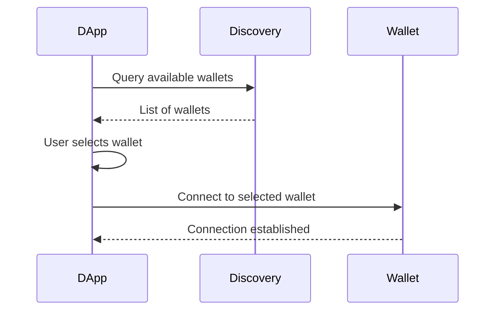
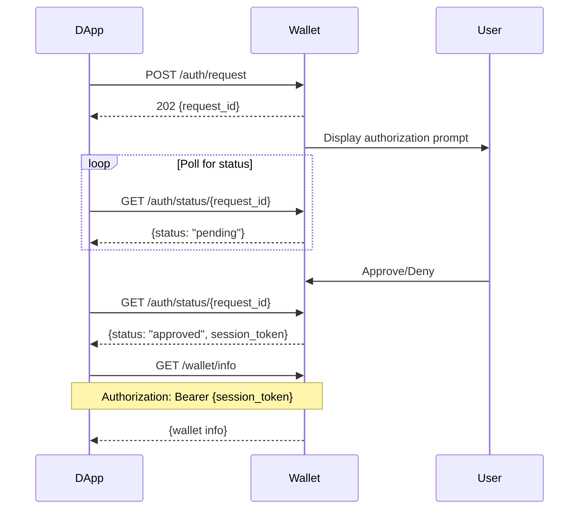

# Xian Universal Wallet Protocol Specification

**Version:** 2.0.0  
**Status:** Draft  
**Last Updated:** 2024

## 1. Introduction

The Xian Universal Wallet Protocol (UWP) is a language-agnostic specification that defines how decentralized applications (DApps) communicate with wallet implementations on the Xian blockchain. This specification ensures interoperability between any wallet implementation and any DApp, regardless of the programming languages used.

### 1.1 Design Principles

- **Language Agnostic**: The protocol can be implemented in any programming language
- **Transport Independent**: While HTTP/JSON is the primary transport, the protocol concepts can be adapted to other transports
- **Security First**: All operations require explicit user authorization
- **Simplicity**: The protocol is simple enough to implement but complete enough for real-world use
- **Extensibility**: New features can be added without breaking existing implementations

### 1.2 Conformance

The key words "MUST", "MUST NOT", "REQUIRED", "SHALL", "SHALL NOT", "SHOULD", "SHOULD NOT", "RECOMMENDED", "MAY", and "OPTIONAL" in this document are to be interpreted as described in [RFC 2119](https://www.ietf.org/rfc/rfc2119.txt).

## 2. Architecture Overview

```
┌─────────────┐         HTTP/WS          ┌─────────────┐
│    DApp     │ ◄──────────────────────► │   Wallet    │
│   (Client)  │                           │  (Server)   │
└─────────────┘                           └─────────────┘
     Any                                       Any
   Language                                 Language
```

### 2.1 Components

- **Wallet Server**: Exposes the protocol API, manages keys, signs transactions
- **DApp Client**: Requests authorization, sends transactions, queries balances
- **Protocol**: Defines the communication format and rules

## 3. Transport Layer

### 3.1 HTTP Transport

- **Protocol**: HTTP/1.1 or HTTP/2
- **Default Port**: 8545 (SHOULD be configurable)
- **Base Path**: `/api/v1`
- **Content Type**: `application/json`
- **Character Encoding**: UTF-8

### 3.2 WebSocket Transport (Optional)

- **Protocol**: WebSocket (RFC 6455)
- **Path**: `/ws/v1`
- **Message Format**: JSON text frames
- **Purpose**: Real-time event notifications
- **Authentication**: REQUIRED - Bearer token via Authorization header or `token` query parameter
- **Connection Lifecycle**: Connection automatically closed on token expiration or revocation

### 3.3 TLS/HTTPS Support (RECOMMENDED)

For production deployments and remote wallet servers:

- **Protocol**: HTTPS with TLS 1.2 or higher
- **Certificate**: Valid SSL certificate (self-signed allowed for development)
- **Port**: 8546 (default for HTTPS, SHOULD be configurable)
- **Enforcement**: Wallets SHOULD enforce HTTPS for non-localhost connections

### 3.4 gRPC Transport (Optional)

For high-performance applications:

- **Protocol**: gRPC over HTTP/2
- **Port**: 8547 (default, SHOULD be configurable)
- **Service Definition**: See `protocol/grpc/wallet.proto`
- **Purpose**: Binary protocol for performance-critical applications

### 3.5 CORS Requirements

Wallet implementations MUST support CORS for web-based DApps:

```
Access-Control-Allow-Origin: *
Access-Control-Allow-Methods: GET, POST, OPTIONS
Access-Control-Allow-Headers: Content-Type, Authorization
Access-Control-Max-Age: 86400
```

Production implementations SHOULD restrict `Access-Control-Allow-Origin` to specific domains.

## 4. Wallet Discovery

### 4.1 Discovery Methods

Wallets SHOULD implement at least one discovery method:

#### 4.1.1 mDNS/DNS-SD (Local Network)

- **Service Type**: `_xian-wallet._tcp`
- **TXT Records**:
  - `version`: Protocol version (e.g., "2.0.0")
  - `name`: Wallet display name
  - `type`: Wallet type (desktop|mobile|hardware|web)
  - `id`: Unique wallet identifier

Example mDNS advertisement:
```
wallet._xian-wallet._tcp.local. 120 IN SRV 0 0 8545 wallet-host.local.
wallet._xian-wallet._tcp.local. 120 IN TXT "version=2.0.0" "name=My Wallet" "type=desktop"
```

#### 4.1.2 Registry Service (Cloud-Based)

Wallets MAY register with a discovery service:

```http
POST https://registry.xian.org/api/v1/wallets/register
{
  "wallet_id": "unique-wallet-id",
  "name": "My Wallet",
  "type": "mobile",
  "endpoint": "https://wallet.example.com:8546",
  "public_key": "...",
  "capabilities": ["qr_pairing", "deep_linking"]
}
```

#### 4.1.3 Browser Extension Detection

Browser-based wallets SHOULD inject a discovery object:

```javascript
window.xianWallets = {
  "wallet-id": {
    name: "My Wallet",
    version: "2.0.0",
    connect: async () => { /* connection logic */ }
  }
}
```

#### 4.1.4 QR Code Discovery

Mobile wallets SHOULD support QR code-based discovery:

```json
{
  "protocol": "xian-uwp",
  "version": "2.0.0",
  "endpoint": "https://wallet.example.com:8546",
  "session_id": "unique-session-id",
  "public_key": "..."
}
```

### 4.2 Discovery Flow



## 5. Mobile Bridge Support

### 5.1 Relay Server Architecture

For mobile-to-web communication:

```
┌─────────────┐     WebSocket      ┌─────────────┐     WebSocket      ┌─────────────┐
│  Web DApp   │ ◄────────────────► │Relay Server │ ◄────────────────► │Mobile Wallet│
└─────────────┘                     └─────────────┘                     └─────────────┘
```

### 5.2 Pairing Flow

#### 5.2.1 QR Code Pairing

1. DApp generates pairing request with unique session ID
2. DApp displays QR code containing relay server URL and session ID
3. Mobile wallet scans QR code
4. Both parties connect to relay server using session ID
5. End-to-end encrypted channel established

#### 5.2.2 Deep Linking

Mobile wallets MUST support deep links:

```
xian-wallet://connect?relay=wss://relay.xian.org&session=abc123&key=...
```

### 5.3 Relay Protocol

Messages relayed between DApp and wallet:

```json
{
  "type": "relay_message",
  "session_id": "unique-session-id",
  "from": "dapp|wallet",
  "encrypted_payload": "base64-encoded-encrypted-data",
  "timestamp": 1234567890
}
```

### 5.4 End-to-End Encryption

All relay messages MUST be encrypted:

1. ECDH key exchange during pairing
2. AES-256-GCM for message encryption
3. HMAC-SHA256 for message authentication

## 6. Authentication & Authorization

### 6.1 Authorization Flow



### 6.2 Session Management

- Session tokens MUST be cryptographically secure (minimum 256 bits of entropy)
- Sessions MUST expire after a configurable timeout (default: 60 minutes)
- Sessions MUST be revocable by the user
- Implementations SHOULD limit the number of concurrent sessions

### 6.3 Refresh Tokens (Optional)

Wallets MAY implement refresh tokens for long-lived sessions:

- **Purpose**: Allow DApps to renew sessions without re-authorization
- **Lifetime**: Refresh tokens SHOULD have longer expiry than session tokens (e.g., 7-30 days)
- **Rotation**: Implementations MAY rotate refresh tokens on each use
- **Storage**: DApps MUST store refresh tokens securely
- **Revocation**: Users MUST be able to revoke refresh tokens

**Refresh Flow:**
```json
// Initial authorization response includes refresh token
{
  "session_token": "st_abc123...",
  "refresh_token": "rt_xyz789...",  // Optional
  "expires_at": "2024-01-01T12:00:00Z",
  "refresh_expires_at": "2024-01-08T12:00:00Z"  // Optional
}

// Refresh request
POST /api/v1/auth/refresh
{
  "refresh_token": "rt_xyz789..."
}

// Response with new tokens
{
  "session_token": "st_new456...",
  "refresh_token": "rt_new012...",  // Optional if rotation enabled
  "expires_at": "2024-01-01T13:00:00Z"
}
```

### 6.4 DApp Identity Verification (Optional)

Wallets MAY implement DApp identity verification for enhanced security:

#### 6.4.1 DApp Registration

DApps can register their identity with a wallet:

```json
POST /api/v1/dapp/register
{
  "app_name": "My DeFi App",
  "app_url": "https://mydefi.app",
  "public_key": "0x1234...",  // Ed25519 or ECDSA public key
  "algorithm": "ed25519",
  "metadata": {
    "description": "Decentralized trading platform",
    "icon": "https://mydefi.app/icon.png",
    "categories": ["DeFi", "Trading"]
  }
}

// Response
{
  "dapp_id": "dapp_1234567890",
  "registered_at": "2024-01-01T12:00:00Z"
}
```

#### 6.4.2 Signed Authorization Requests

Registered DApps can sign their authorization requests:

```json
POST /api/v1/auth/request
{
  "app_name": "My DeFi App",
  "app_url": "https://mydefi.app",
  "permissions": ["wallet_info", "balance"],
  "dapp_id": "dapp_1234567890",
  "timestamp": 1234567890,
  "signature": "0xabcd..."  // Sign(app_name + app_url + permissions + timestamp)
}
```

Benefits:
- Users see verified DApp identity
- Protection against phishing
- Request integrity verification
- Replay attack prevention

### 6.5 Permissions

Permissions control what operations a DApp can perform:

| Permission | Description | Operations Allowed |
|------------|-------------|-------------------|
| `wallet_info` | Basic wallet information | GET /wallet/info |
| `balance` | Read token balances | GET /balance/* |
| `transactions` | Send transactions | POST /transaction |
| `sign_message` | Sign messages | POST /sign |
| `add_token` | Add custom tokens | POST /tokens/add |

## 7. API Endpoints

### 7.1 Status Endpoints (No Auth Required)

#### GET /api/v1/wallet/status

Returns wallet availability and basic status.

**Response:**
```json
{
  "available": true,
  "locked": false,
  "wallet_type": "desktop",
  "network": "https://testnet.xian.org",
  "chain_id": "xian-testnet-1",
  "version": "2.0.0"
}
```

### 7.2 Authorization Endpoints

#### POST /api/v1/auth/request

Request authorization from the wallet.

**Request:**
```json
{
  "app_name": "My DApp",
  "app_url": "https://mydapp.com",
  "permissions": ["wallet_info", "balance", "transactions"],
  "description": "Optional description"
}
```

**Response:** 202 Accepted
```json
{
  "request_id": "abc123...",
  "status": "pending",
  "app_name": "My DApp"
}
```

#### GET /api/v1/auth/status/{request_id}

Check authorization request status.

**Response (Pending):**
```json
{
  "request_id": "abc123...",
  "status": "pending",
  "app_name": "My DApp"
}
```

**Response (Approved):**
```json
{
  "session_token": "token123...",
  "expires_at": "2024-01-01T12:00:00Z",
  "permissions": ["wallet_info", "balance"],
  "status": "approved"
}
```

### 7.3 Wallet Endpoints (Auth Required)

All endpoints in this section require the `Authorization: Bearer {session_token}` header.

#### GET /api/v1/wallet/info

Get wallet information. Requires `wallet_info` permission.

**Response:**
```json
{
  "address": "1234567890abcdef...",
  "truncated_address": "1234...cdef",
  "locked": false,
  "chain_id": "xian-testnet-1",
  "network": "https://testnet.xian.org",
  "wallet_type": "desktop",
  "version": "1.0.0"
}
```

#### POST /api/v1/wallet/unlock

Unlock the wallet with a password.

**Request:**
```json
{
  "password": "user_password"
}
```

### 7.4 Transaction Endpoints (Auth Required)

#### POST /api/v1/transaction

Send a transaction. Requires `transactions` permission.

**Request:**
```json
{
  "contract": "currency",
  "function": "transfer",
  "kwargs": {
    "to": "recipient_address",
    "amount": 100.5
  },
  "stamps_supplied": 50000
}
```

**Response:**
```json
{
  "success": true,
  "transaction_hash": "abc123...",
  "result": {...},
  "gas_used": 21000
}
```

#### POST /api/v1/sign

Sign a message. Requires `sign_message` permission.

**Request:**
```json
{
  "message": "Hello, Xian!"
}
```

**Response:**
```json
{
  "signature": "0xsignature...",
  "message": "Hello, Xian!",
  "address": "signer_address"
}
```

### 7.5 Token Endpoints (Auth Required)

#### GET /api/v1/balance/{contract}

Get token balance. Requires `balance` permission.

**Response:**
```json
{
  "balance": 1000.5,
  "contract": "currency",
  "symbol": "XIAN",
  "decimals": 18
}
```

## 8. Error Handling

### 8.1 Error Response Format

All error responses MUST follow this format:

```json
{
  "error": "Human-readable error message",
  "code": "ERROR_CODE",
  "details": {
    "field": "Optional field that caused the error",
    "reason": "Detailed technical reason",
    "suggestion": "How to fix the error"
  },
  "request_id": "Original request ID if applicable",
  "timestamp": "ISO8601 timestamp"
}
```

### 8.2 Standard Error Codes

#### Authentication & Authorization Errors

| Code | HTTP Status | Description | Recovery |
|------|-------------|-------------|----------|
| `WALLET_LOCKED` | 423 | Wallet is locked | User must unlock wallet |
| `UNAUTHORIZED` | 401 | Missing or invalid authorization | Request new authorization |
| `SESSION_EXPIRED` | 401 | Session token has expired | Request new authorization |
| `INVALID_TOKEN` | 401 | Invalid session token format | Request new authorization |
| `PERMISSION_DENIED` | 403 | Operation not permitted | Request additional permissions |
| `AUTH_PENDING` | 202 | Authorization still pending | Continue polling |
| `AUTH_DENIED` | 403 | User denied authorization | Inform user, retry later |
| `AUTH_TIMEOUT` | 408 | Authorization request timed out | Create new request |

#### Request Validation Errors

| Code | HTTP Status | Description | Recovery |
|------|-------------|-------------|----------|
| `INVALID_REQUEST` | 400 | Request validation failed | Check request format |
| `MISSING_PARAMETER` | 400 | Required parameter missing | Add missing parameter |
| `INVALID_PARAMETER` | 400 | Parameter value invalid | Correct parameter value |
| `INVALID_ADDRESS` | 400 | Invalid blockchain address | Validate address format |
| `INVALID_AMOUNT` | 400 | Invalid amount value | Check amount format |
| `INVALID_CONTRACT` | 400 | Contract does not exist | Verify contract name |

#### Transaction Errors

| Code | HTTP Status | Description | Recovery |
|------|-------------|-------------|----------|
| `INSUFFICIENT_BALANCE` | 400 | Insufficient token balance | Check balance first |
| `INSUFFICIENT_STAMPS` | 400 | Insufficient stamps for transaction | Increase stamps_supplied |
| `TRANSACTION_FAILED` | 400 | Transaction execution failed | Check error details |
| `SIMULATION_FAILED` | 400 | Transaction simulation failed | Review transaction parameters |
| `NONCE_MISMATCH` | 409 | Transaction nonce conflict | Retry with correct nonce |
| `ALREADY_SUBMITTED` | 409 | Transaction already submitted | Check transaction status |

#### System Errors

| Code | HTTP Status | Description | Recovery |
|------|-------------|-------------|----------|
| `WALLET_NOT_FOUND` | 404 | Wallet service not available | Check wallet is running |
| `ENDPOINT_NOT_FOUND` | 404 | API endpoint does not exist | Check API version |
| `METHOD_NOT_ALLOWED` | 405 | HTTP method not allowed | Use correct HTTP method |
| `MAX_SESSIONS_EXCEEDED` | 429 | Too many active sessions | Close existing sessions |
| `RATE_LIMIT_EXCEEDED` | 429 | Too many requests | Implement backoff |
| `SERVICE_UNAVAILABLE` | 503 | Wallet service unavailable | Retry with backoff |
| `INTERNAL_ERROR` | 500 | Internal server error | Report bug, retry later |
| `NOT_IMPLEMENTED` | 501 | Feature not implemented | Use alternative method |

#### Discovery & Pairing Errors

| Code | HTTP Status | Description | Recovery |
|------|-------------|-------------|----------|
| `DISCOVERY_FAILED` | 503 | Wallet discovery failed | Check network, retry |
| `PAIRING_FAILED` | 400 | QR/Deep link pairing failed | Generate new pairing request |
| `RELAY_UNAVAILABLE` | 503 | Relay server unavailable | Use direct connection |
| `ENCRYPTION_FAILED` | 500 | E2E encryption setup failed | Retry pairing |

### 8.3 HTTP Status Codes

- **200 OK**: Request succeeded
- **202 Accepted**: Request accepted, processing async
- **400 Bad Request**: Invalid request format or parameters
- **401 Unauthorized**: Authentication required or failed
- **403 Forbidden**: Insufficient permissions
- **404 Not Found**: Resource not found
- **423 Locked**: Wallet is locked
- **429 Too Many Requests**: Rate limit exceeded
- **500 Internal Server Error**: Server error
- **503 Service Unavailable**: Wallet service unavailable

## 9. Security Considerations

### 7.1 Transport Security

- Production deployments SHOULD use HTTPS
- Local development MAY use HTTP
- WebSocket connections SHOULD use WSS in production

### 7.2 Session Security

- Session tokens MUST be generated using cryptographically secure random number generators
- Session tokens MUST be at least 32 bytes (256 bits) of entropy
- Session tokens MUST NOT be logged or stored in plain text
- Sessions MUST be invalidated on logout or timeout

### 7.3 Rate Limiting

Implementations MUST implement rate limiting for:
- Authorization requests (e.g., max 10 per minute)
- Password attempts (e.g., exponential backoff after failures)
- Transaction requests (e.g., max 100 per minute)

### 7.4 Input Validation

All inputs MUST be validated:
- String lengths must be checked
- URLs must be validated
- Contract and function names must match allowed patterns
- Numeric values must be within acceptable ranges

## 10. WebSocket Events (Optional)

WebSocket connections enable real-time notifications:

### 8.1 Event Types

```json
{
  "type": "authorization_request",
  "request_id": "abc123",
  "app_name": "My DApp",
  "timestamp": "2024-01-01T12:00:00Z"
}
```

```json
{
  "type": "authorization_update",
  "request_id": "abc123",
  "status": "approved",
  "session_token": "token123",
  "timestamp": "2024-01-01T12:00:00Z"
}
```

```json
{
  "type": "transaction_update",
  "transaction_hash": "0xabc...",
  "status": "confirmed",
  "confirmations": 3,
  "timestamp": "2024-01-01T12:00:00Z"
}
```

## 11. Implementation Requirements

### 9.1 Minimum Required Endpoints

A conforming implementation MUST support:

1. `GET /api/v1/wallet/status`
2. `POST /api/v1/auth/request`
3. `GET /api/v1/auth/status/{request_id}`
4. `GET /api/v1/wallet/info` (with auth)
5. `POST /api/v1/transaction` (with auth)

### 9.2 Optional Features

Implementations MAY support:
- WebSocket events
- Additional token management endpoints
- Custom extensions (must use `/api/v1/x/` prefix)

### 9.3 Compliance Testing

Implementations MUST pass all test vectors in:
- `/protocol/test-vectors/auth-flow.json`
- `/protocol/test-vectors/transaction-flow.json`

## 12. Versioning

### 10.1 Protocol Version

The protocol version follows Semantic Versioning:
- MAJOR: Breaking API changes
- MINOR: New functionality additions
- PATCH: Bug fixes and clarifications

### 10.2 Version Negotiation

Clients SHOULD check the protocol version via `/api/v1/wallet/status` and handle version mismatches gracefully.

## 13. Extensions

### 11.1 Custom Endpoints

Implementations MAY add custom endpoints under `/api/v1/x/`:
- `/api/v1/x/vendor/feature`
- Custom endpoints MUST NOT conflict with standard endpoints
- Custom endpoints SHOULD follow the same conventions

### 11.2 Additional Permissions

Implementations MAY define additional permissions with `x_` prefix:
- `x_vendor_feature`
- Custom permissions MUST be documented

## 14. References

- [RFC 2119](https://www.ietf.org/rfc/rfc2119.txt) - Key words for use in RFCs
- [RFC 6455](https://tools.ietf.org/html/rfc6455) - The WebSocket Protocol
- [RFC 7231](https://tools.ietf.org/html/rfc7231) - HTTP/1.1 Semantics
- [JSON Schema](https://json-schema.org/) - JSON Schema Specification
- [OpenAPI 3.0](https://swagger.io/specification/) - OpenAPI Specification

## Appendix A: Example Implementation Flow

```python
# DApp Example (Python)
import httpx
import time

# 1. Request authorization
client = httpx.Client(base_url="http://localhost:8545")
auth_response = client.post("/api/v1/auth/request", json={
    "app_name": "My DApp",
    "app_url": "https://mydapp.com",
    "permissions": ["wallet_info", "balance", "transactions"]
})
request_id = auth_response.json()["request_id"]

# 2. Poll for approval
while True:
    status = client.get(f"/api/v1/auth/status/{request_id}")
    data = status.json()
    if data["status"] == "approved":
        session_token = data["session_token"]
        break
    elif data["status"] == "denied":
        raise Exception("Authorization denied")
    time.sleep(1)

# 3. Use the wallet
headers = {"Authorization": f"Bearer {session_token}"}
wallet_info = client.get("/api/v1/wallet/info", headers=headers)
print(wallet_info.json())

# 4. Send transaction
tx_result = client.post("/api/v1/transaction", 
    headers=headers,
    json={
        "contract": "currency",
        "function": "transfer",
        "kwargs": {"to": "recipient", "amount": 100}
    }
)
print(tx_result.json())
```

## Appendix B: Change Log

### Version 2.0.0 (2024)
- Initial release as language-agnostic specification
- OpenAPI specification for machine-readable API definition
- JSON Schema definitions for all message formats
- Test vectors for compliance testing
- Comprehensive security requirements
- WebSocket support for real-time updates (optional)